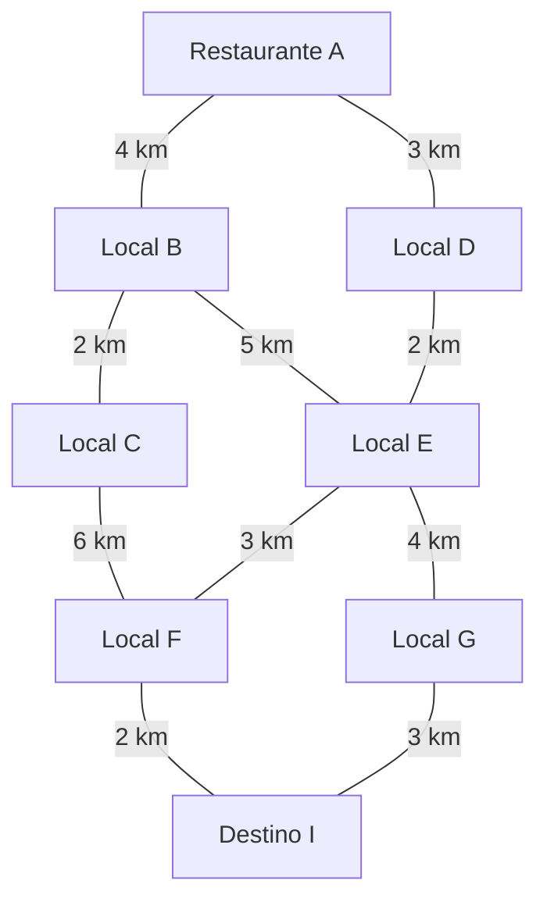

# Rota Inteligente: Otimização de Entregas com Algoritmos de IA

Projeto acadêmico desenvolvido para a disciplina **Artificial Intelligence Fundamentals**, do curso de **Gestão de Tecnologia da Informação**, com foco na aplicação de algoritmos de Inteligência Artificial na área de logística e entregas.

O projeto apresenta uma solução simplificada para a empresa fictícia **Sabor Express**, que precisa encontrar rotas de entrega e organizar pedidos próximos para melhorar o planejamento das entregas.

## 1. Introdução

Empresas de delivery precisam realizar várias entregas em diferentes locais. Quando essas entregas são organizadas manualmente, podem ocorrer problemas como:

- escolha de caminhos mais longos;
- aumento do consumo de combustível;
- atrasos nas entregas;
- dificuldade para organizar pedidos próximos;
- maior tempo de deslocamento dos entregadores.

A Inteligência Artificial pode ajudar a resolver esses problemas por meio de algoritmos capazes de analisar caminhos, calcular custos e identificar padrões nos dados.

Neste projeto, a cidade foi representada por um grafo ponderado. O algoritmo A* foi utilizado para buscar uma rota de menor custo, enquanto o algoritmo BFS foi utilizado para comparação. Também foi aplicado o algoritmo K-Means para agrupar pedidos conforme a proximidade de suas coordenadas.

## 2. Descrição do problema

A empresa fictícia Sabor Express realiza entregas em diferentes pontos de uma cidade.

Para este projeto, considera-se que a empresa possui:

- um ponto de origem para as entregas;
- diferentes pontos de destino;
- ruas com distâncias variadas;
- pedidos localizados em diferentes regiões;
- necessidade de organizar as rotas de maneira mais eficiente.

O problema principal consiste em encontrar um caminho entre a origem e o destino que tenha a menor distância possível.

Além disso, é necessário identificar pedidos que estejam próximos uns dos outros. Dessa forma, os pedidos podem ser organizados em grupos ou regiões, facilitando o planejamento das entregas.

A solução desenvolvida neste trabalho é uma simulação acadêmica. O mapa, as distâncias e os pedidos utilizados são fictícios.

## 3. Objetivos

### 3.1 Objetivo geral

Demonstrar como algoritmos de Inteligência Artificial podem ser utilizados para apoiar a otimização de rotas e a organização de pedidos em uma empresa de delivery.

### 3.2 Objetivos específicos

- Representar uma cidade por meio de um grafo ponderado.
- Identificar uma rota entre um ponto de origem e um ponto de destino.
- Utilizar o algoritmo A* para encontrar uma rota de menor custo.
- Utilizar o algoritmo BFS para comparar os caminhos encontrados.
- Aplicar o algoritmo K-Means para agrupar pedidos próximos.
- Armazenar os pedidos em um arquivo CSV.
- Registrar os resultados da execução em um arquivo de texto.
- Avaliar as limitações da solução desenvolvida.
- Identificar possíveis melhorias para uma aplicação futura.

## 4. Tecnologias utilizadas

O projeto foi desenvolvido utilizando:

- **Python 3**;
- estruturas de dados como listas, dicionários e filas;
- arquivo CSV para armazenar os pedidos;
- algoritmos de busca em grafos;
- algoritmo de agrupamento K-Means;
- GitHub para armazenamento e apresentação do projeto.

O programa utiliza recursos básicos do Python e não depende de bibliotecas externas complexas para sua execução.

## 5. Representação da cidade como grafo

A cidade foi representada por um grafo ponderado.

Um grafo é uma estrutura formada por:

- **vértices**, que representam pontos ou locais;
- **arestas**, que representam as conexões entre esses pontos;
- **pesos**, que representam o custo de cada conexão.

Neste projeto:

- os vértices são identificados pelas letras A até I;
- as arestas representam as ruas;
- os pesos representam as distâncias entre os pontos;
- o ponto A representa a origem;
- o ponto I representa o destino final.

O grafo é ponderado porque cada rua possui uma distância diferente.

Isso é importante porque o caminho com menos ruas não é necessariamente o caminho com menor distância total.

Por exemplo, uma rota pode possuir quatro ruas curtas e outra rota pode possuir três ruas muito longas. Nesse caso, a rota com mais ruas pode ser a mais curta em quilômetros.

## 5.1 Diagrama do Grafo

O grafo representa os pontos de entrega e as distâncias entre eles. 
As letras representam os locais e os números representam as distâncias em quilômetros.



## 6. Algoritmos utilizados

### 6.1 Algoritmo A*

O A* é um algoritmo de busca utilizado para encontrar caminhos de menor custo em grafos.

Ele combina duas informações:

1. o custo do caminho que já foi percorrido;
2. uma estimativa do custo restante até o destino.

O algoritmo utiliza a fórmula:

```text
f(n) = g(n) + h(n)
